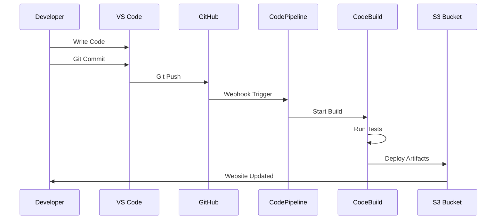

#  Automated CI/CD Pipeline with AWS

[](https://github.com/yourusername/your-repo)
[](https://aws.amazon.com/codepipeline/)
[](https://your-s3-website-url.com)

> **A complete CI/CD pipeline showcasing modern DevOps practices with AWS services, automatic deployments, and zero-downtime updates.**


## 🎯 Overview

This project demonstrates a **fully automated CI/CD pipeline** that:

✅ **Automatically detects** code changes in GitHub  
✅ **Builds and tests** the application using AWS CodeBuild  
✅ **Deploys instantly** to AWS S3 static website hosting  
✅ **Provides real-time** pipeline status and notifications  
✅ **Ensures zero-downtime** deployments with rollback capabilities  

### 🌟 Key Features

- **Continuous Integration**: Automatic builds triggered by Git commits
- **Continuous Deployment**: Seamless deployment to production
- **Infrastructure as Code**: Reproducible AWS resource setup
- **Monitoring & Logging**: Complete visibility into deployment process
- **Security**: IAM roles with least privilege access
- **Cost-Effective**: Pay-per-use AWS services

## 🏗️ Architecture

```mermaid
graph LR
    A[👨‍💻 Developer] --> B[📝 VS Code]
    B --> C[🔄 Git Commit]
    C --> D[📚 GitHub Repository]
    D --> E[🔗 AWS CodePipeline]
    E --> F[🔨 AWS CodeBuild]
    F --> G[🪣 S3 Bucket]
    G --> H[🌐 Static Website]
    
    style A fill:#e1f5fe
    style E fill:#fff3e0
    style F fill:#fff3e0
    style G fill:#e8f5e8
    style H fill:#f3e5f5
```



### Pipeline Stages

1. **Source Stage**: GitHub repository integration
2. **Build Stage**: AWS CodeBuild compilation and testing
3. **Deploy Stage**: Automated deployment to S3 static hosting

## 🛠️ Technologies Used

| Category | Technology | Purpose |
|----------|------------|---------|
| **Frontend** | HTML5, CSS3, JavaScript | Web application development |
| **Development** | VS Code, Git | Code editing and version control |
| **Source Control** | GitHub | Repository hosting and webhooks |
| **CI/CD** | AWS CodePipeline | Pipeline orchestration |
| **Build** | AWS CodeBuild | Automated building and testing |
| **Hosting** | AWS S3 | Static website hosting |
| **Infrastructure** | AWS IAM | Security and access management |

## 📋 Prerequisites

Before setting up this pipeline, ensure you have:

- [x] **AWS Account** with appropriate permissions
- [x] **GitHub Account** with repository access
- [x] **VS Code** installed with Git integration
- [x] **AWS CLI** configured (optional but recommended)
- [x] **Node.js** (if using npm packages)

## 🚀 Setup Guide

### Step 1: Repository Setup

```bash
# Clone the repository
git clone https://github.com/yourusername/cicd-pipeline-demo.git
cd cicd-pipeline-demo

# Install dependencies (if any)
npm install

# Make your changes
code .
```

### Step 2: AWS S3 Configuration

**📸 Screenshot Placeholder: S3 Bucket Creation**
> *[Insert screenshot of S3 bucket creation with static website hosting enabled]*

1. Create S3 bucket with unique name
2. Enable static website hosting
3. Configure bucket policy for public access
4. Set index.html as default document

### Step 3: AWS CodeBuild Project

**📸 Screenshot Placeholder: CodeBuild Project Setup**
> *[Insert screenshot of CodeBuild project configuration]*

Create `buildspec.yml` in your repository root:

```yaml
version: 0.2

phases:
  pre_build:
    commands:
      - echo Logging in to Amazon ECR...
      - echo Build started on `date`
      - echo Installing dependencies...
      
  build:
    commands:
      - echo Build started on `date`
      - echo Building the application...
      - # Add your build commands here
      
  post_build:
    commands:
      - echo Build completed on `date`
      
artifacts:
  files:
    - '**/*'
  base-directory: '.'
```

### Step 4: AWS CodePipeline Setup

**📸 Screenshot Placeholder: CodePipeline Configuration**
> *[Insert screenshot of CodePipeline stages configuration]*

1. **Source Stage**: Connect to GitHub repository
2. **Build Stage**: Link to CodeBuild project
3. **Deploy Stage**: Configure S3 deployment

### Step 5: GitHub Integration

**📸 Screenshot Placeholder: GitHub AWS Connector**
> *[Insert screenshot of GitHub Apps AWS Connector installation]*

- Install AWS Connector for GitHub
- Configure repository permissions
- Set up webhook for automatic triggers

## 🔄 Pipeline Workflow

### Automated Deployment Process



### Real-time Pipeline Monitoring

**📸 Screenshot Placeholder: Pipeline Execution**
> *[Insert screenshot of CodePipeline execution in progress]*

## 📸 Screenshots

### Development Environment
**📸 Screenshot Placeholder: VS Code Setup**
> *[Insert screenshot of VS Code with your project open]*

### Pipeline Dashboard
**📸 Screenshot Placeholder: CodePipeline Dashboard**
> *[Insert screenshot of successful pipeline execution]*

### Build Logs
**📸 Screenshot Placeholder: CodeBuild Logs**
> *[Insert screenshot of build logs showing successful compilation]*

### Live Website
**📸 Screenshot Placeholder: S3 Hosted Website**
> *[Insert screenshot of your live website]*

## 🎬 Demo Video

**🎥 Screen Recording Placeholder**
> *[Insert link to screen recording showing:]*
> - *Code changes in VS Code*
> - *Git commit and push process*
> - *Pipeline automatic triggering*
> - *Build process execution*
> - *Live website update*

**Example:**
```markdown
[](https://www.youtube.com/watch?v=YOUR_VIDEO_ID)
```

## 📁 Project Structure

```
cicd-pipeline-demo/
├── 📄 README.md                 # This documentation
├── 📄 buildspec.yml            # CodeBuild configuration
├── 📄 index.html               # Main HTML file
├── 📁 css/
│   └── 📄 style.css           # Stylesheet
├── 📁 js/
│   └── 📄 script.js           # JavaScript files
├── 📁 images/
│   └── 🖼️ assets              # Image assets
├── 📁 docs/
│   └── 📸 screenshots/        # Documentation images
└── 📄 .gitignore              # Git ignore rules
```

## ⚙️ Pipeline Configuration

### Environment Variables

| Variable | Description | Example |
|----------|-------------|---------|
| `S3_BUCKET` | Target S3 bucket name | `my-app-hosting-bucket` |
| `AWS_REGION` | AWS deployment region | `us-east-1` |
| `BUILD_ENV` | Build environment | `production` |

### IAM Roles and Permissions

**CodeBuild Service Role Permissions:**
```json
{
    "Version": "2012-10-17",
    "Statement": [
        {
            "Effect": "Allow",
            "Action": [
                "s3:PutObject",
                "s3:GetObject",
                "s3:DeleteObject"
            ],
            "Resource": "arn:aws:s3:::your-bucket-name/*"
        }
    ]
}
```

### Build Process Details

1. **Source Checkout**: Code retrieved from GitHub
2. **Dependency Installation**: Install required packages
3. **Code Compilation**: Build static assets
4. **Testing**: Run automated tests (if configured)
5. **Artifact Creation**: Package deployable files
6. **S3 Deployment**: Upload to S3 bucket
7. **Cache Invalidation**: Clear CDN cache (if using CloudFront)

## 🐛 Troubleshooting

### Common Issues and Solutions

| Issue | Cause | Solution |
|-------|-------|----------|
| **Pipeline fails at Build** | Permission errors | Check CodeBuild IAM role permissions |
| **403 Forbidden on website** | S3 bucket policy | Update bucket policy for public access |
| **Pipeline not triggering** | GitHub webhook issues | Verify AWS Connector installation |
| **Build succeeds but no deployment** | Artifact configuration | Check buildspec.yml artifacts section |

### Debug Commands

```bash
# Check AWS CLI configuration
aws sts get-caller-identity

# Validate buildspec.yml
aws codebuild batch-get-builds --ids your-build-id

# Test S3 bucket access
aws s3 ls s3://your-bucket-name
```

## 🏆 Best Practices

### Security
- ✅ Use IAM roles with least privilege principle
- ✅ Enable S3 bucket encryption
- ✅ Regular security audits of permissions
- ✅ Use AWS Secrets Manager for sensitive data

### Performance
- ✅ Implement build caching for faster builds
- ✅ Use CloudFront CDN for global distribution
- ✅ Optimize images and assets
- ✅ Enable gzip compression

### Monitoring
- ✅ Set up CloudWatch alarms for pipeline failures
- ✅ Configure SNS notifications
- ✅ Monitor build minutes usage
- ✅ Regular pipeline performance reviews

## 💰 Cost Optimization

### AWS Service Costs
- **CodePipeline**: $1/month per active pipeline
- **CodeBuild**: $0.005/minute (first 100 minutes free monthly)
- **S3**: $0.023/GB storage + data transfer costs
- **CloudWatch**: Minimal logging costs

### Cost Reduction Tips
1. Use S3 Intelligent Tiering
2. Set up lifecycle policies for build artifacts
3. Monitor and optimize build times
4. Use CloudFront for reduced S3 data transfer costs

## 🔮 Future Enhancements

- [ ] **Multi-environment deployments** (dev, staging, prod)
- [ ] **Blue-green deployment strategy**
- [ ] **Automated testing integration**
- [ ] **Security scanning in pipeline**
- [ ] **Performance monitoring**
- [ ] **Slack/Teams notifications**
- [ ] **Infrastructure as Code** with CloudFormation

## 🤝 Contributing

1. Fork the repository
2. Create a feature branch (`git checkout -b feature/amazing-feature`)
3. Commit your changes (`git commit -m 'Add amazing feature'`)
4. Push to the branch (`git push origin feature/amazing-feature`)
5. Open a Pull Request

## 📞 Support

If you encounter any issues or have questions:

- 📧 **Email**: your.email@example.com
- 🐛 **Issues**: [GitHub Issues](https://github.com/yourusername/your-repo/issues)
- 💬 **Discussions**: [GitHub Discussions](https://github.com/yourusername/your-repo/discussions)

## 📜 License

This project is licensed under the MIT License - see the [LICENSE](LICENSE) file for details.

---

## 🙏 Acknowledgments

- AWS Documentation and tutorials
- DevOps community best practices
- Open source contributors

---

**⭐ If this project helped you, please give it a star on GitHub!**

---

*Last updated: June 2025*
