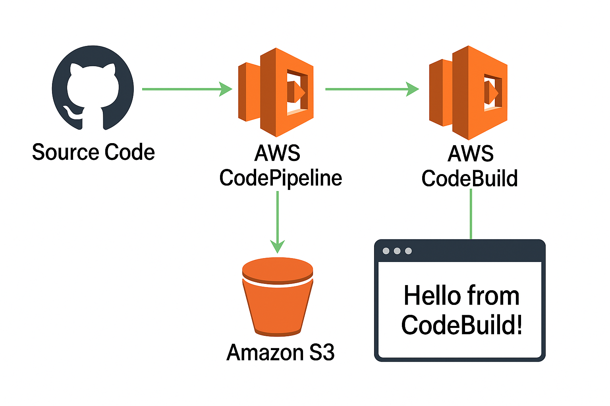
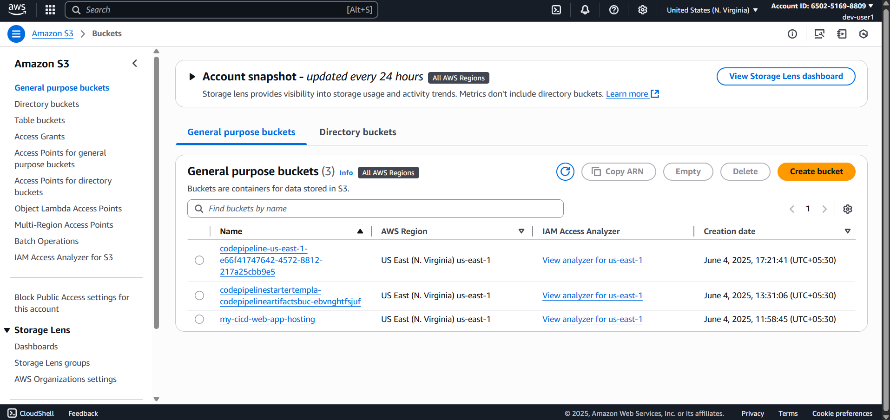
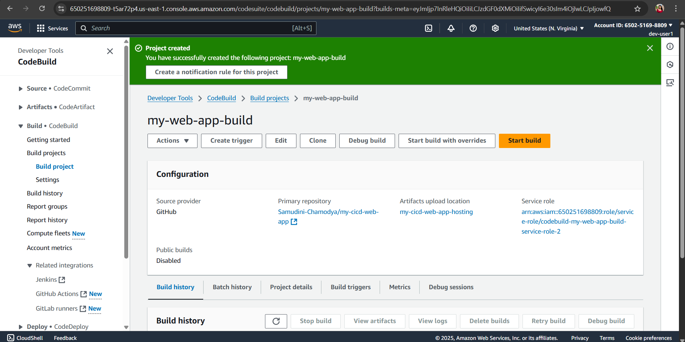
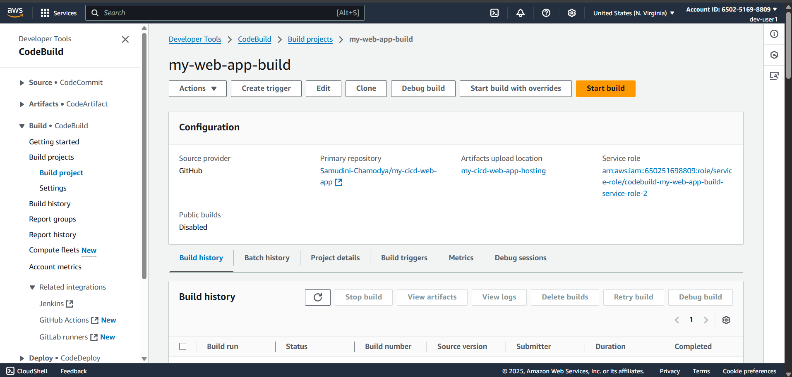
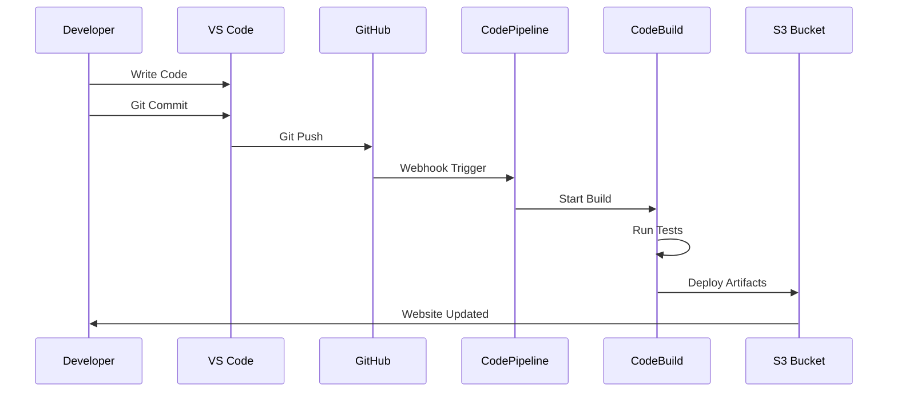
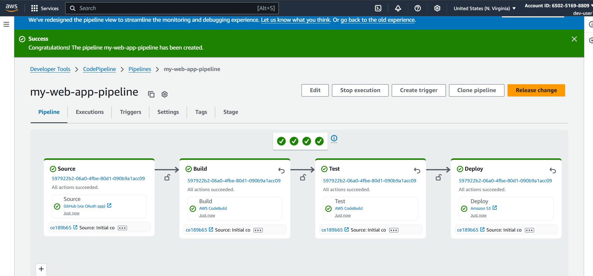
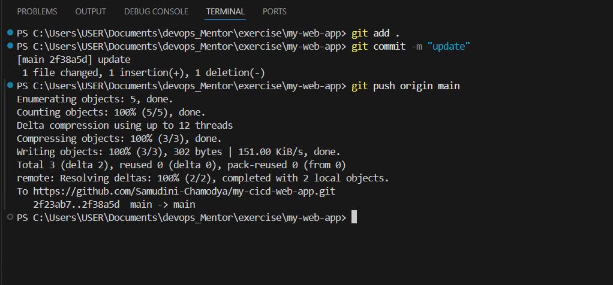
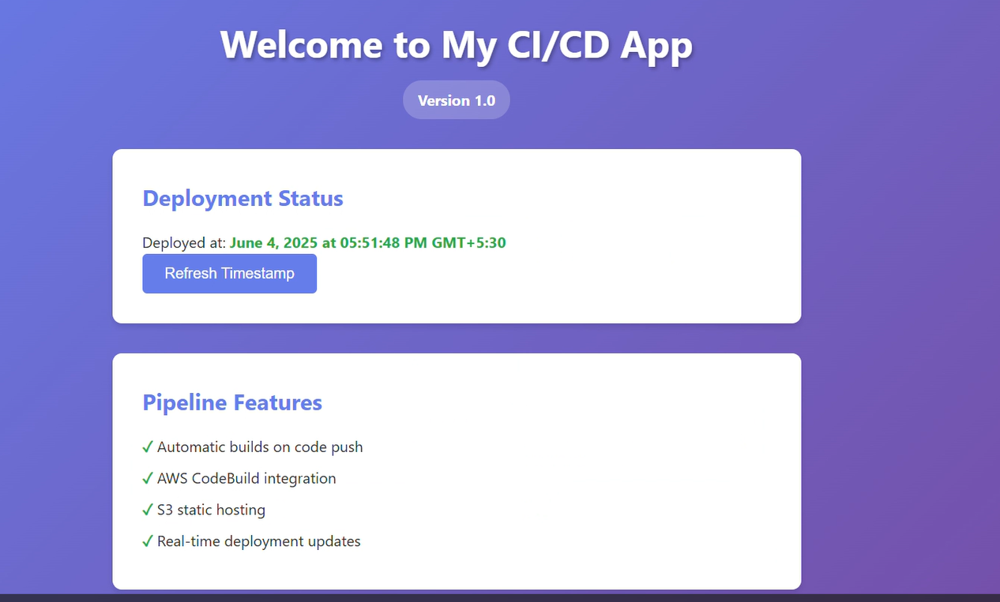
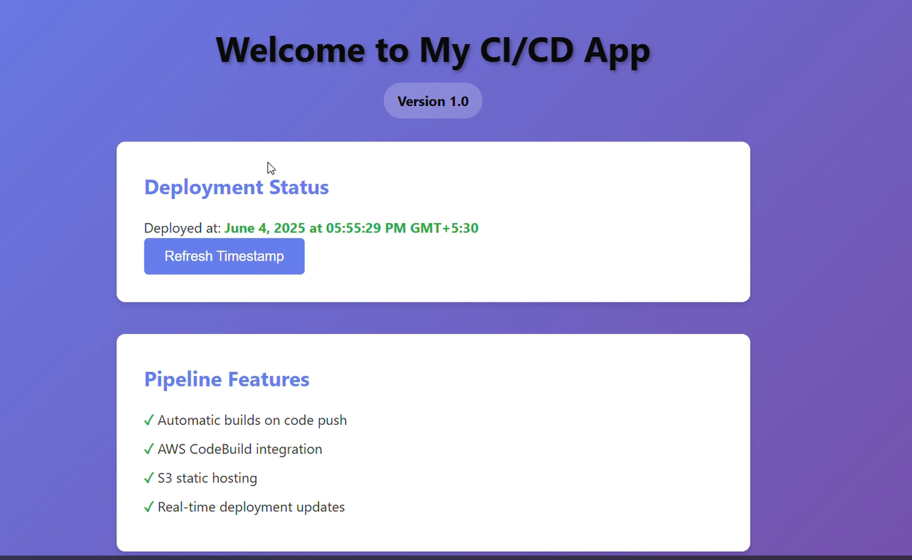

#  Automated CI/CD Pipeline with AWS

> **A complete CI/CD pipeline showcasing modern DevOps practices with AWS services, automatic deployments, and zero-downtime updates.**

+ 


##  Overview

This project demonstrates a **fully automated CI/CD pipeline** that:

✅ **Automatically detects** code changes in GitHub  
✅ **Builds and tests** the application using AWS CodeBuild  
✅ **Deploys instantly** to AWS S3 static website hosting  
✅ **Provides real-time** pipeline status and notifications  
✅ **Ensures zero-downtime** deployments with rollback capabilities  

### 🌟 Key Features

- **Continuous Integration**: Automatic builds triggered by Git commits
- **Continuous Deployment**: Seamless deployment to production
- **Infrastructure as Code**: Reproducible AWS resource setup
- **Monitoring & Logging**: Complete visibility into deployment process
- **Security**: IAM roles with least privilege access
- **Cost-Effective**: Pay-per-use AWS services


### Pipeline Stages

1. **Source Stage**: GitHub repository integration
2. **Build Stage**: AWS CodeBuild compilation and testing
3. **Deploy Stage**: Automated deployment to S3 static hosting

##  Technologies Used

| Category | Technology | Purpose |
|----------|------------|---------|
| **Frontend** | HTML5, CSS3, JavaScript | Web application development |
| **Development** | VS Code, Git | Code editing and version control |
| **Source Control** | GitHub | Repository hosting and webhooks |
| **CI/CD** | AWS CodePipeline | Pipeline orchestration |
| **Build** | AWS CodeBuild | Automated building and testing |
| **Hosting** | AWS S3 | Static website hosting |
| **Infrastructure** | AWS IAM | Security and access management |

##  Prerequisites

Before setting up this pipeline, ensure you have:

- [x] **AWS Account** with appropriate permissions
- [x] **GitHub Account** with repository access
- [x] **VS Code** installed with Git integration
- [x] **AWS CLI** configured (optional but recommended)
- [x] **Node.js** (if using npm packages)

## Setup Guide

### Repository Setup

```bash
# Clone the repository
git clone https://github.com/yourusername/cicd-pipeline-demo.git
cd cicd-pipeline-demo

# Install dependencies (if any)
npm install

# Make your changes
code .
```

### AWS S3 Configuration

**📸S3 Bucket Creation**
+ 


1. Create S3 bucket with unique name
2. Enable static website hosting
3. Configure bucket policy for public access
4. Set index.html as default document

### Step 3: AWS CodeBuild Project

**📸 CodeBuild Project Setup**
+ 


Create `buildspec.yml` in your repository root:

```yaml
version: 0.2

phases:
  pre_build:
    commands:
      - echo Logging in to Amazon ECR...
      - echo Build started on `date`
      - echo Installing dependencies...
      
  build:
    commands:
      - echo Build started on `date`
      - echo Building the application...
      - # Add your build commands here
      
  post_build:
    commands:
      - echo Build completed on `date`
      
artifacts:
  files:
    - '**/*'
  base-directory: '.'
```

### AWS CodePipeline Setup

**📸 CodePipeline Configuration**
+ 

1. **Source Stage**: Connect to GitHub repository
2. **Build Stage**: Link to CodeBuild project
3. **Deploy Stage**: Configure S3 deployment


## 🔄 Pipeline Workflow

### Automated Deployment Process



### Real-time Pipeline Monitoring

**📸 Pipeline Execution**
+ 

## 📸 Screenshots

### Development Environment
**📸 VS Code Terminal**
+ 


### Live Website
**📸 Live Web app before any changes**
+ 

### Live Website
**📸 Live Web app after changes**
+ 

## Pipeline Configuration

### Environment Variables

| Variable | Description | Example |
|----------|-------------|---------|
| `S3_BUCKET` | Target S3 bucket name | `my-app-hosting-bucket` |
| `AWS_REGION` | AWS deployment region | `us-east-1` |
| `BUILD_ENV` | Build environment | `production` |

### IAM Roles and Permissions

**CodeBuild Service Role Permissions:**
```json
{
    "Version": "2012-10-17",
    "Statement": [
        {
            "Effect": "Allow",
            "Action": [
                "s3:PutObject",
                "s3:GetObject",
                "s3:DeleteObject"
            ],
            "Resource": "arn:aws:s3:::my-cicd-web-app-hosting/*"
        }
    ]
}
```

### Build Process Details

1. **Source Checkout**: Code retrieved from GitHub
2. **Dependency Installation**: Install required packages
3. **Code Compilation**: Build static assets
4. **Testing**: Run automated tests (if configured)
5. **Artifact Creation**: Package deployable files
6. **S3 Deployment**: Upload to S3 bucket
7. **Cache Invalidation**: Clear CDN cache (if using CloudFront)


### Common Issues and Solutions

| Issue | Cause | Solution |
|-------|-------|----------|
| **Pipeline fails at Build** | Permission errors | Check CodeBuild IAM role permissions |
| **403 Forbidden on website** | S3 bucket policy | Update bucket policy for public access |
| **Pipeline not triggering** | GitHub webhook issues | Verify AWS Connector installation |
| **Build succeeds but no deployment** | Artifact configuration | Check buildspec.yml artifacts section |

### Debug Commands

```bash
# Check AWS CLI configuration
aws sts get-caller-identity

# Validate buildspec.yml
aws codebuild batch-get-builds --ids your-build-id

# Test S3 bucket access
aws s3 ls s3://your-bucket-name
```

##  Best Practices

### Security
- ✅ Use IAM roles with least privilege principle
- ✅ Enable S3 bucket encryption
- ✅ Regular security audits of permissions
- ✅ Use AWS Secrets Manager for sensitive data

### Performance
- ✅ Implement build caching for faster builds
- ✅ Use CloudFront CDN for global distribution
- ✅ Optimize images and assets
- ✅ Enable gzip compression

### Monitoring
- ✅ Set up CloudWatch alarms for pipeline failures
- ✅ Configure SNS notifications
- ✅ Monitor build minutes usage
- ✅ Regular pipeline performance reviews


## Future Enhancements

- [ ] **Multi-environment deployments** (dev, staging, prod)
- [ ] **Blue-green deployment strategy**
- [ ] **Automated testing integration**
- [ ] **Security scanning in pipeline**
- [ ] **Performance monitoring**
- [ ] **Slack/Teams notifications**
- [ ] **Infrastructure as Code** with CloudFormation

##  Contributing

1. Fork the repository
2. Commit your changes (`git commit -m 'Add amazing feature'`)
3. Push to the branch (`git push origin feature/amazing-feature`)


- 📧 **Email**: samudinirupasinha@gmail.com

